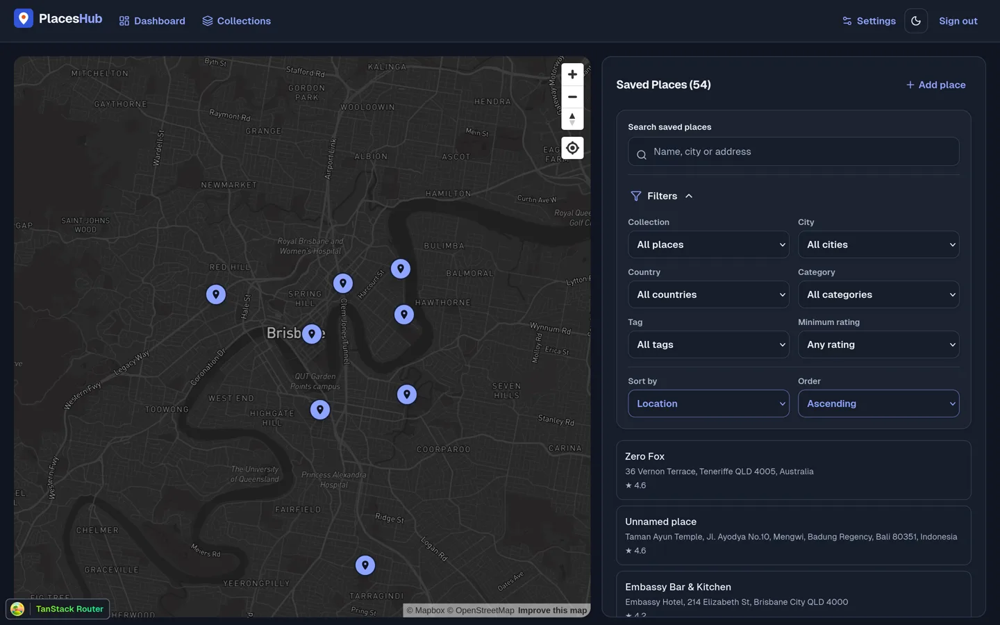
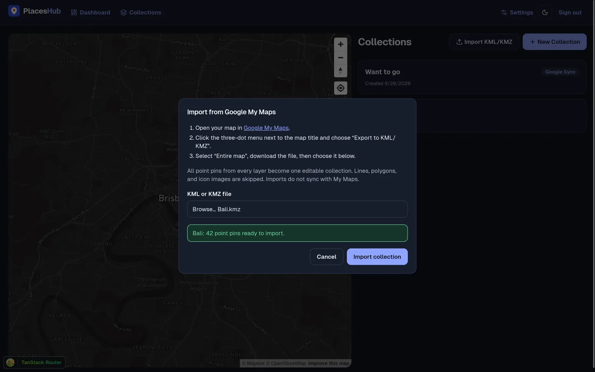
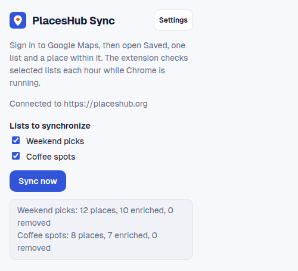
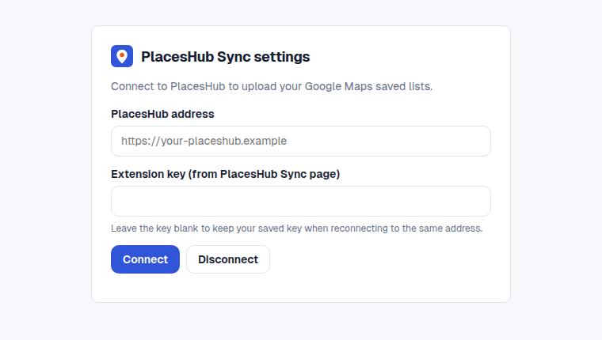

# PlacesHub

PlacesHub brings saved Google Maps places into one map. Sync saved lists with the
Chrome or Firefox extension, import KML/KMZ or GeoJSON files, organise places
into collections with notes, and share a public map or export KML.

**Website:** [placeshub.org](https://placeshub.org) · **Extension setup:**
[Chrome and Firefox instructions](docs/list-sync.md)

### App preview

| Browse saved places on a map | Import a Google My Maps KML/KMZ collection |
| --- | --- |
|  |  |

### Extension preview

| Select lists and see sync results (example data) | Connect with a revocable extension key |
| --- | --- |
|  |  |

## Stack

- **Web**: Vite + React + TanStack Router (file-based routing)
- **API**: Hono on Cloudflare Workers
- **Database**: Supabase PostgreSQL with PostGIS, Drizzle ORM
- **Maps**: Mapbox GL JS
- **Monorepo**: Turborepo
- **Linting/Formatting**: Biome

## Apps and Packages

- `@placeshub/web`: Vite + React frontend
- `@placeshub/api`: Hono API on Cloudflare Workers
- `@placeshub/db`: Drizzle ORM schema and migrations
- `@repo/ui`: Shared React components
- `@repo/typescript-config`: Shared tsconfig

## Local development

Use Node 24 and pnpm 12.6.0. Copy `.env.example` to `.env.local` and set the
Supabase URL and anon key, database URL, server-side Google Places API key, and
public Mapbox token. The API loads `.env.local`; the web app reads its `VITE_`
variables. Never put the database URL or Google Places API key in a `VITE_`
variable.

For local Supabase, follow the [CLI and Studio setup guide](docs/local-development.md).
Apply the [database migrations](docs/database-migrations.md) before starting the app.

```sh
pnpm install --frozen-lockfile
pnpm dev
```

This starts the web app at `http://localhost:3013` and the API at
`http://localhost:4000`. Sign in or create an account to use the dashboard;
public share links and the marketing page do not require sign-in.

### Checks

```sh
pnpm check         # Biome check
pnpm check-types   # TypeScript type-check
pnpm build         # Production build
pnpm --filter @placeshub/web test
pnpm --filter @placeshub/extension test
```

## Database migrations

See [database migrations](docs/database-migrations.md) for bootstrap order,
Drizzle migration behavior and missing-table troubleshooting.

## Google Maps list sync (Chrome and Firefox extensions)

See [Google Maps list sync](docs/list-sync.md) for local installation, connection,
scheduled sync and troubleshooting. See [extension publishing](docs/extension-publishing.md)
for store submission requirements.

## Import map collections

See [map import](docs/map-import.md) for Google My Maps exports, GeoJSON point
collections, supported fields and file limits.

## AI agent access (MCP)

1. Apply the database migrations above, including `004-mcp-api-keys.sql` and `005-place-enrichment.sql`.
2. Sign in and open **Settings → AI agents**. Create a key and copy it once.
   Send it as `Authorization: Bearer phm_…`.
3. Connect via Streamable HTTP at `https://placeshub.org/api/mcp` (locally
   `http://localhost:3013/api/mcp`). Every request includes the key; no session
   ID is needed.

Example remote MCP client configuration (replace the key and keep it outside
version control):

```json
{
  "mcpServers": {
    "placeshub": {
      "url": "https://placeshub.org/api/mcp",
      "headers": { "Authorization": "Bearer phm_<your-key>" }
    }
  }
}
```

Tools cover place search, saved places, collections, notes, tags, and collection
membership. Bulk calls accept 1–100 items and roll back the entire batch if any
item is invalid or unowned. `savedPlaceId` identifies a user's saved row;
`placeId` identifies the shared place used in collection memberships. Deleting
a saved row or collection does not delete shared place data. Extension `phs_`
keys cannot use MCP. Revoke MCP keys in **Settings → AI agents**.

## Deploy

Deploy the API to Cloudflare Workers and the web app to Cloudflare Pages. The
Pages Function forwards `/api/*` to the Worker over a service binding, so the
browser and the Chrome/Firefox extensions use the same origin. See
[production deployment](docs/deployment.md) for setup, required variables, and
smoke checks.
